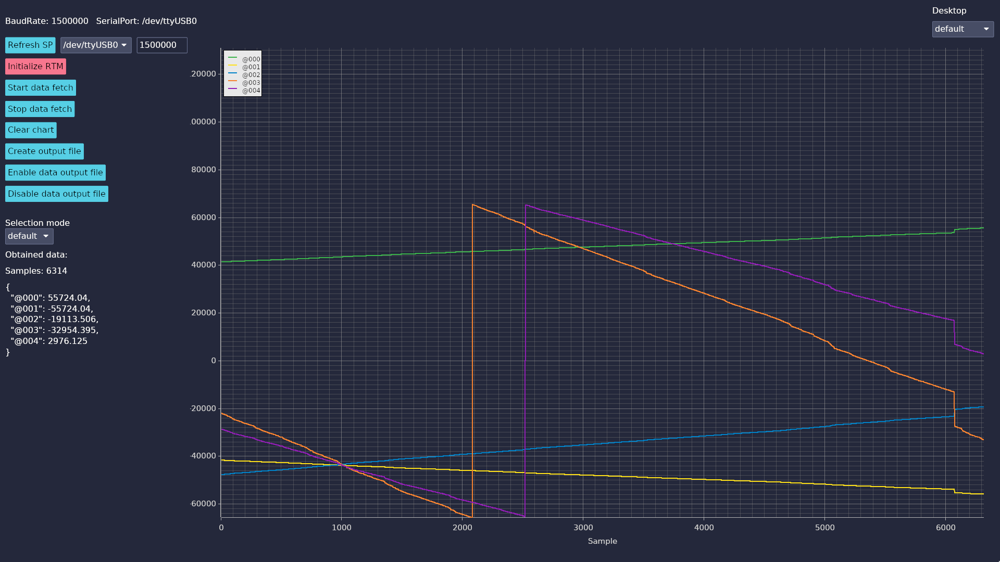

# Internal FPGA Signal Monitor Unit with Rust Real-Time Monitor Display Application
_The Documentation and Repository files are currently under the development and may change in the future._

## Software Component - Rust Real-Time Monitor

Dark Mode GUI             | Light Mode GUI 
:-------------------------:|:-------------------------:
  |  

### Release build

For building the application for production environment, use following command.

```bash
cargo build --release
```

### Debug Mode

Even though the [sudo](https://crates.io/crates/sudo) crate is used to enable `sudo` mode when debugging the application (needed for access to serial ports) the following command is usefull when running the debug mode on your architecture.

```bash
CARGO_TARGET_X86_64_UNKNOWN_LINUX_GNU_RUNNER='sudo -E -S' cargo watch -x run
```

- `CARGO_TARGET_X86_64_UNKNOWN_LINUX_GNU_RUNNER` is the platform as available at [The rustc book - Platform Support](https://doc.rust-lang.org/rustc/platform-support.html), the reference of Environmental variables may be found at [The Cargo Book](https://doc.rust-lang.org/cargo/reference/config.html)
- `sudo -E -S`
    - `-E` flag is used to preserve the current user's environmental variables
    - `-S` flag (stdin) option causes sudo to read the password from stan-dard input instead of the terminal device.
    - `cargo watch -x run` is command available when [cargo watch](https://crates.io/crates/cargo-watch) is installed globally

### Running the application on macOS with UART -> USB converter

For the TTL232R-3V3 device to be recognizable by macOS, the library `libftd2xx.dylib` must be installed. The installation must be probably done according to the readme file included in the downloaded `dmg` file of the library. After the installation, restart the machine and the FTDI device should be named as FTDI device and working.

[Check the guide for macOS FTDI](https://www.ftdichip.com/Support/Documents/InstallGuides/Mac_OS_X_Installation_Guide.pdf)

[Download drivers for FTDI devices](https://ftdichip.com/drivers/d2xx-drivers/)

## Hardware Component

### Simulation

For behavioral simulation [cocotb](https://www.cocotb.org/) in conjuction with [Verilator](https://www.veripool.org/verilator/) can be used. In fact, Verilator is set as the used simulator in Python cocotb files. The design for simulation purposes may be different from the design used for synthesizing to a GOWIN FPGA. The core elements are the same, but for the sake of simulation time, the frequency, input signals, etc. may differ.

In the future, there may be a merge of the folders containing code for simulation and synthesis. It would be good to unify all aspects of the design.

The waveforms generated waveforms then may be opened using [GTKWave](https://gtkwave.sourceforge.net/).

#### Perform simulation

To perform simulation, navigate to [fpga/sim/coco](fpga/sim/coco) and check the [Makefile](fpga/sim/coco/Makefile) for available commands. The recent one is `make pytestMonit` which runs the simulation for 'monit' module.

The simulation can be modified using corresponding Python file.

### Synthesis, PAR, bitstream

The design files modified for synthesis onto Gowin GW1NR-9 27 MHz [SiPeed Tang Nano 9k board](https://wiki.sipeed.com/hardware/en/tang/Tang-Nano-9K/Nano-9K.html) are available at [fpga/gowin/comm/src](fpga/gowin/comm/src). Whereas the project, which may be opened in [Gowin EDA](https://www.gowinsemi.com/en/support/home/) is located at [fpga/gowin/comm/comm.gprj](fpga/gowin/comm/comm.gprj).

If the bitstream, generated from Gowin EDA cannot be loaded onto the FPGA, the [openFPGALoader](https://github.com/trabucayre/openFPGALoader) is recommended.

Load the bitstream to the board via following command.

```bash
sudo openFPGALoader -b tangnano9k comm.fs
```

where `tangnano9k` is your board. For further questions or issues please consult the openFPGALoader documentation.
